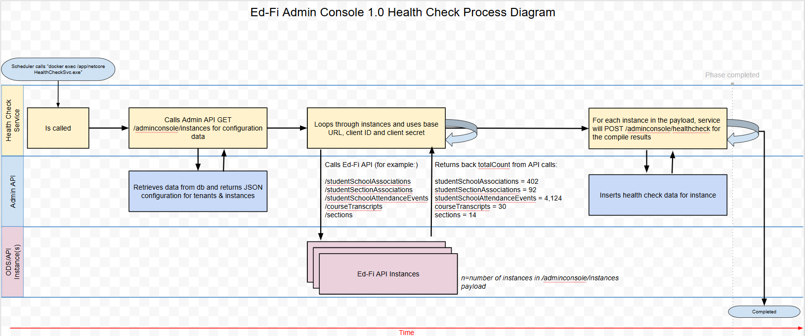

# Health Check Service - Developer Instructions

## Development Pre-Requisites

- [.NET 8.0 SDK](https://dotnet.microsoft.com/download/dotnet/8.0)
- Suggested to have either:
  - [Visual Studio 2022](https://visualstudio.microsoft.com/downloads), or
  - [Visual Studio 2022 Build
    Tools](https://visualstudio.microsoft.com/downloads/#build-tools-for-visual-studio-2022)
    (install the ".NET Build Tools" component)
- Clone [this
  repository](https://github.com/Ed-Fi-Alliance-OSS/Ed-Fi-Admin-Console-Services.git) locally

## Application Flow

The application executes 3 main steps.

1. Get instances data from `Admin Api - Admin Console extension`.
2. For each instances returned from `Admin Api - Admin Console extension`, and based on the Endpoints set on the `appsettings.json` call the Ods Api to collect the data necessary to generate the HealthCheck payload.
3. Call the HealthCheck endpoint on the `Admin Api - Admin Console extension` to send the payload generated. 



## Project Initial Configuration

This project depends on AdminAPI, so it will be require to provide some information at `Application/EdFi.AdminConsole.HealthCheckService/appsettings.json`.
The credentials (ClientId and ClientSecret) are provided as part of the executable command arguments.
`Ed-Fi-Admin-Console-Health-Check-Worker-Process` will also make requests to the Ods Api based on the information returned from the `Admin Api - Admin Console extension` on the `instances` endpoint.
Following you can find an example of the `appsettings.json` file. You can use this as a reference.

```json
{
  "AppSettings": {
    "IgnoresCertificateErrors": false
  },
  "AdminApiSettings": {
    "ApiUrl": "api url",
    "AdminConsoleInstancesURI": "/adminconsole/instances",
    "AdminConsoleHealthCheckURI": "/adminconsole/healthcheck",
    "AccessTokenUrl": "token url"
  },
  "OdsApiSettings": {
    "Endpoints": [
      "studentSpecialEducationProgramAssociations",
      "studentDisciplineIncidentBehaviorAssociations",
      "studentSchoolAssociations",
      "studentSchoolAttendanceEvents",
      "studentSectionAssociations",
      "staffEducationOrganizationAssignmentAssociations",
      "staffSectionAssociations",
      "courseTranscripts",
      "sections"
    ]
  }
}
```

### AppSettings

|Setting|Description|
|---|---|
|IgnoresCertificateErrors|Set this on `True` to bypass the SSL validations on the http connection to the Admin Api and Ods Api|

Make sure it is set to `False` on a production environment. 

### AdminApiSettings

Contains all the necessary information to get connected to the Admin Api, with the exeption of the credentials as mentioned before.

### OdsApiSettings

|Setting|Description|
|---|---|
|Endpoints|List of Ods Api endpoints to be called for building the HealthCheck payload|

### Command line arguments

|Argument|Description|
|---|---|
|IsMultiTenant|Set this value to true, when `Ed-Fi-Admin-Console-Health-Check-Worker-Process` is goging to be executed on a Multitenant configuration. Default value is `false`.|
|Tenant|Tenant name. Required when Admin Api has been set up in a Multitenant mode.|
|ClientId|ClientId to get connected to the Admin Api. Required.|
|ClientSecret|ClientSecret to get connected to the Admin Api. Required.|

## Requests to the Ods Api

Based on the information returned from the instances endpoint on the `Admin Api - Admin Console extension` this application will be making calls to the Ods Api in order to be able to generate the `HealthCheck` payload.
This means, the information such as Urls, credentials, etc. must be part of the instance information. If the instance data is incorrect or is not properly formed, this application wont be able to generate the `HealthCheck` payload.
The data required is the following.

|Setting|Description|
|---|---|
|TenantId|Tenant identifier|
|InstanceId|Instance identifier|
|InstanceName|Instance name|
|BaseUrl|Example: https://api.ed-fi.org/v7.1/api|
|ResourcesUrl|Example: /data/v3/ed-fi/|
|AuthenticationUrl|Example: /oauth/token/|
|ClientId|`ClientId`|
|ClientSecret|`ClientSecret`|

## Multitenancy mode

In a context where the Admin Api has been set up in a Multitenant mode, Ed-Fi-Admin-Console-Health-Check-Worker-Process needs to be executed once per each tenant.

## Launch the project

Since this is a Console Application, it can be executed from a terminal. Review the `Application flow` section for more information. 

## Build and run the application on Docker container

In order to be able to execute the application on a docker container we need to build it first.
Execute the following command on a terminal `from the repository main folder`

```bash
docker build -f Docker/Dockerfile -t edfi.adminconsole.healthcheckservice .
```

Once the Docker image has been built, we can execute the following command to run the application.

Multitenant mode
```bash
docker run -it edfi.adminconsole.healthcheckservice --isMultiTenant=true --tenant="<tenant>" --ClientId="<ClientId>" --ClientSecret="<ClientSecret>"
```

Singletenant mode
```bash
docker run -it edfi.adminconsole.healthcheckservice --ClientId="<ClientId>" --ClientSecret="<ClientSecret>"
```

In case you want the container to be removed automatically once the application has completed its execution, include the `--rm` parameter. 
